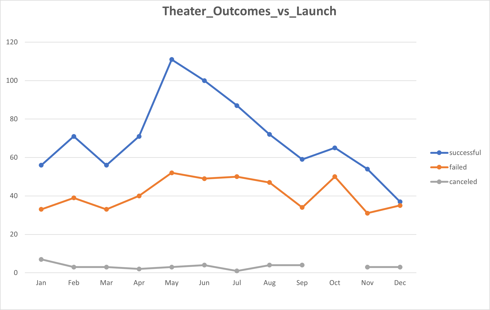
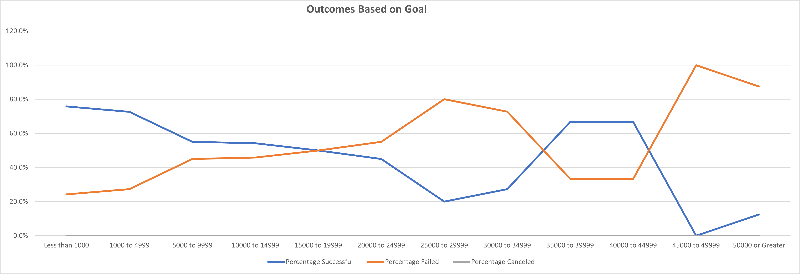

# An Analysis of Kickstarter Campaigns

## Overview of Project

The purpose of this project is to document campaign outcomes based on launch dates and funding goals, and in particular plays. The goal of the analysis is to provide context for previous and future campaign efforts.   

## Analysis and Challenges

The analysis consisted of two parts, a review of outcomes based on kickstarter (a) launch dates, and (b) goals (outlined below). Data, consisting of several performance types in addition to plays, were in MS Excel format provided by the organizers of the University of Texas Data Analytics and Visualization Boot Camp. Data were analyzed using a MS Excel pivot table. 

### Analysis of Outcomes Based on Launch Date

The initial investigation looked at plays with kickstarter campaigns beginning in January 2011 through April 2017 in 21 countries. Data were grouped by starting month for all years

.

### Analysis of Outcomes Based on Goals

Test 

.

### Challenges and Difficulties Encountered

## Results

- What are two conclusions you can draw about the Outcomes based on Launch Date?

- What can you conclude about the Outcomes based on Goals?

- What are some limitations of this dataset?

- What are some other possible tables and/or graphs that we could create?
