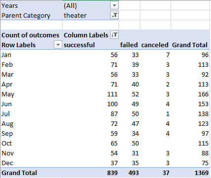
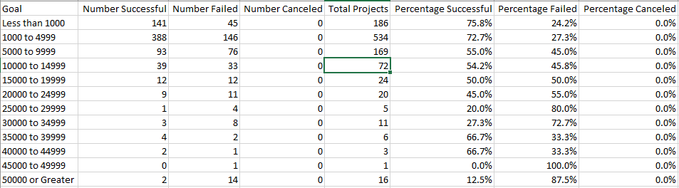
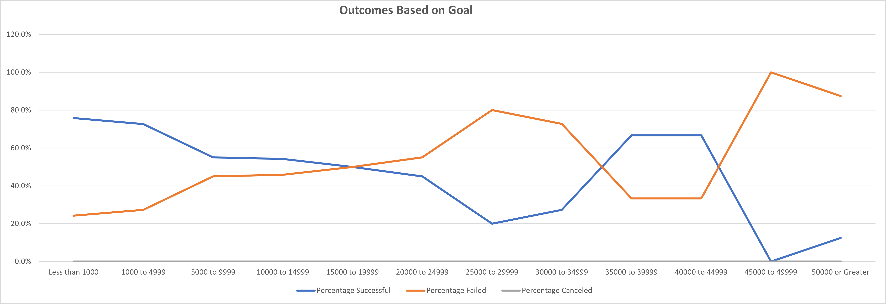

# An Analysis of Kickstarter Campaigns

## Overview of Project

The purpose of this project is to document campaign outcomes based on launch dates and funding goals, and in particular plays. The goal of the analysis is to provide context for previous and future campaign efforts.   

## Analysis and Challenges

The analysis consisted of two parts, a review of outcomes based on kickstarter (a) launch dates, and (b) goals (outlined below). Data, consisting of several performance categories in addition to theater, were in MS Excel format provided by the organizers of the University of Texas Data Analytics and Visualization Boot Camp. Data were analyzed using MS Excel pivot tables and appropriate formulas.  

### Analysis of Outcomes Based on Launch Date

The initial investigation looked at theater kickstarter campaigns beginning in January 2011 through April 2017 in 21 countries that were either successful, failed, or canceled. Results were grouped by starting month for all years and counted according to final outcome. The resulting MS Excel pivot table looked like this: 

.

### Analysis of Outcomes Based on Goals

The second investigation looked at plays with kickstarter campaigns beginning in January 2011 through April 2017 in 21 countries that were either successful, failed, or canceled. In this case, data were grouped by initial goal and counted according to final outcome. The percentage of cases for each final outcome was also calculated. The resulting MS Excel pivot table looked like this: 

.

### Challenges and Difficulties Encountered

Several fields were added to the original MS Excel file that may require lookup or reference. Specifically, users seeking to replicate must be comfortable: (a) separating one column into two using *Test to Column* under the *Data* tab; (b) converting Unix timestamps; and (c) using the *YEAR, COUNTIFS, and SUM* functions.  

## Results

### Outcomes Based on Launch Date

Looking at kickstarter theater launches by month reveals the following:
- The highest success rate for theater campaigns were for those launched in May, with more than two-thirds being successful. Following May in success rate were June and July. 
- After May, the success rate for theater campaigns decreases steadily as the year goes on, for the most part, culminating with roughly the same number (and percentage) of campaigns succeeding as failing in December.   

.

### Outcomes Based on Goals

Looking at kickstarter play launches by month reveals the following:
- The lower the goal for play kickstarter campaigns, the greater the chance of success. Efforts with a goal of less than $1,000 were the most successful (76%), followed by campaigns with a goal between $1,000 and $4,999 (73%).  
- No kickstarter campaigns were canceled, suggesting efforts came to fruition at a greater rate than other subcategories. 
- Interestingly, there were a larger number of plays with a goal of $50,000 or greater than some smaller ranges, with the vast majority failing. This somewhat confirms the larger the goal, the less likely it will succeed. 

.

- What are some limitations of this dataset?
- There were very few plays with a goal between $25,000 and $50,000, making generalizations about their potential for success difficult. 
- There were very few plays with a goal between $25,000 and $50,000, making generalizations about their potential for success difficult. 

- What are some other possible tables and/or graphs that we could create?

